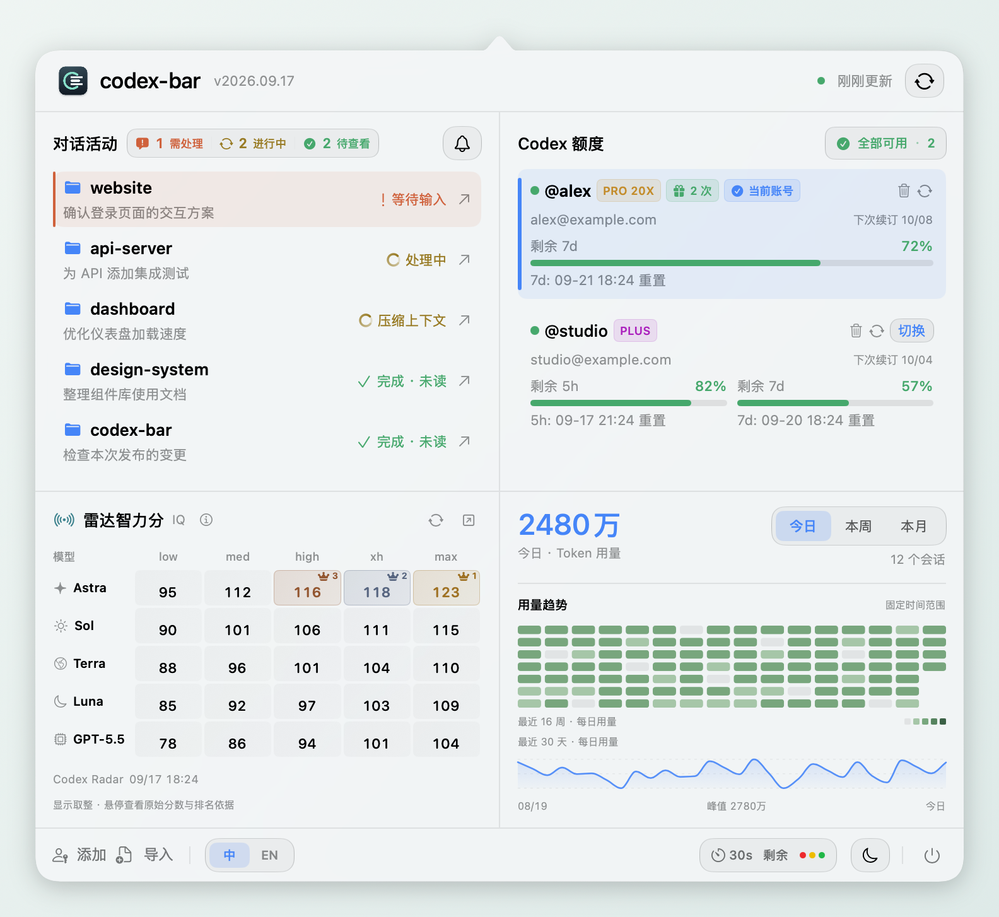
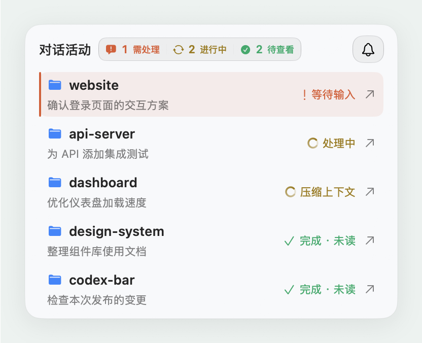
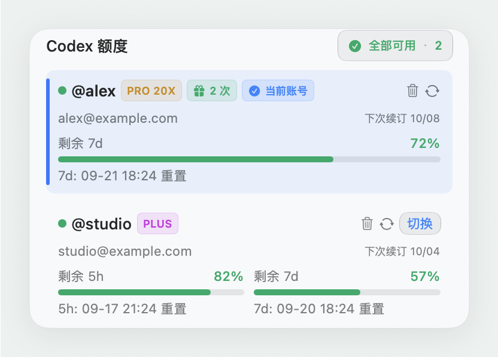
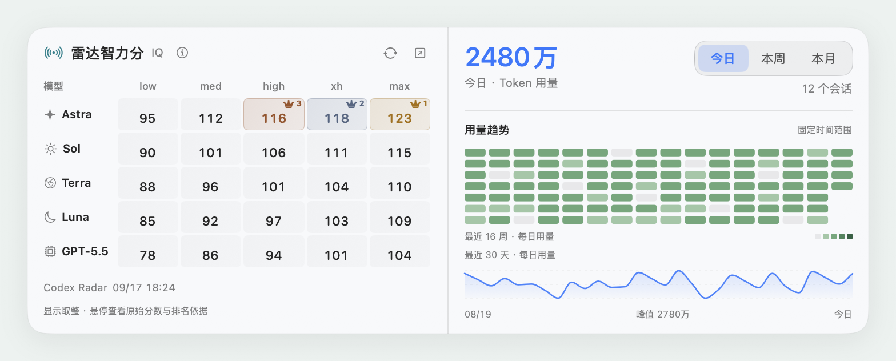
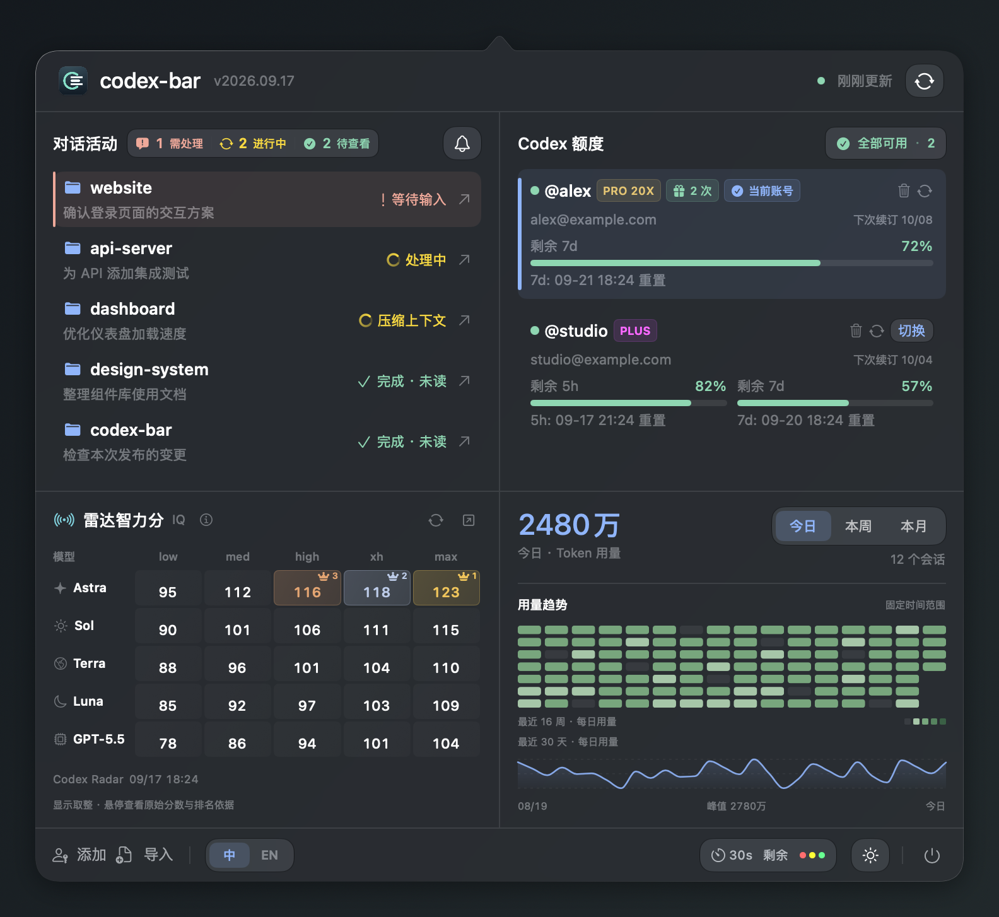
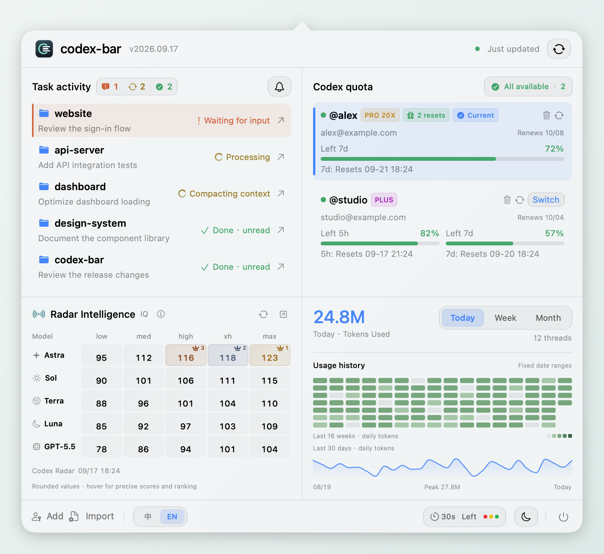
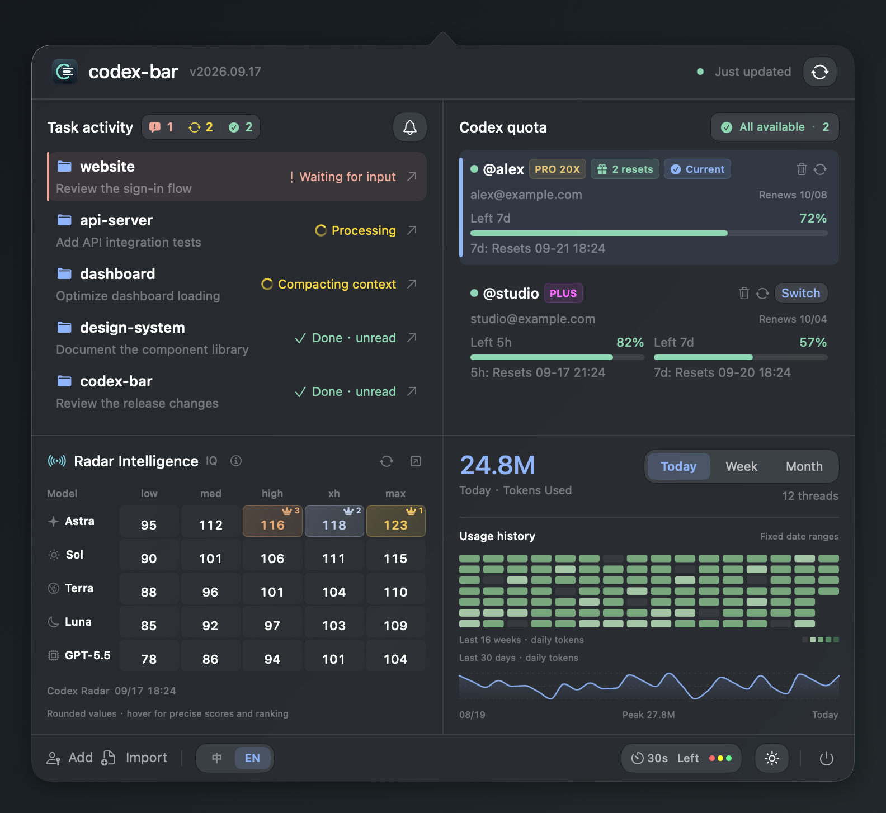

<h1 align="center">
<picture>
  <source media="(prefers-color-scheme: dark)" srcset="docs/assets/brand-zh-dark.svg">
  <source media="(prefers-color-scheme: light)" srcset="docs/assets/brand-zh-light.svg">
  
</picture>
</h1>

为 Codex 打造的原生 macOS 菜单栏助手。

  

  <a href="#快速开始">快速开始</a> · <a href="docs/guide.zh-CN.md">使用指南</a> · <a href="https://github.com/j-tide/codex-bar/issues">反馈问题</a> · <a href="README_EN.md">English</a>

  
  
  

<picture>
  <source media="(prefers-color-scheme: dark)" srcset="docs/assets/overview-zh-dark.png">
  <source media="(prefers-color-scheme: light)" srcset="docs/assets/overview-zh-light.png">
  
</picture>

原生 SwiftUI · 浅色 / 深色 · 中文 / English 截图使用示例数据，账号、任务与评分仅用于展示。

## 跟上每个任务的进展

<picture>
  <source media="(prefers-color-scheme: dark)" srcset="docs/assets/tasks-zh-dark.png">
  <source media="(prefers-color-scheme: light)" srcset="docs/assets/tasks-zh-light.png">
  
</picture>

多个 Codex 任务并行时，打开菜单栏就知道哪里需要你。

- **状态一目了然**：进行中、等待输入、压缩上下文与完成未读。
- **一键回到对话**：按 Codex 侧栏顺序展示，点击即可继续。
- **需要你时再提醒**：可开启完成与待处理通知，通知中不包含对话内容。

[连接任务状态 →](docs/guide.zh-CN.md#3-连接任务状态)

 

## 切换账号之前，先看清额度

<picture>
  <source media="(prefers-color-scheme: dark)" srcset="docs/assets/accounts-zh-dark.png">
  <source media="(prefers-color-scheme: light)" srcset="docs/assets/accounts-zh-light.png">
  
</picture>

当前账号与备用账号放在一起，余量、重置时间和订阅状态清楚可见。

- **多账号管理**：OAuth 登录或导入账号，随时刷新与切换。
- **按套餐展示**：Plus 的 5h / 7d 窗口，Pro 的 7d 窗口。
- **切换方式可选**：仅切换账号，或切换后重启 Codex。

[了解账号与额度 →](docs/guide.zh-CN.md#2-添加账号)

 

## 选模型有参考，用多少有记录

**模型评分矩阵**，让模型与推理强度的比较更直观。**本地 Token 统计**，让今天、本周、本月的使用节奏更清晰。

<picture>
  <source media="(prefers-color-scheme: dark)" srcset="docs/assets/insights-zh-dark.png">
  <source media="(prefers-color-scheme: light)" srcset="docs/assets/insights-zh-light.png">
  
</picture>

Codex Radar 第三方评分 · 30 天用量曲线 · 16 周热力图 · 区间内去重的会话统计

查看全部主题与语言截图

<table>
  <tr><th>简体中文 · 浅色</th><th>简体中文 · 深色</th></tr>
  <tr>
    <td></td>
    <td></td>
  </tr>
  <tr><th>English · Light</th><th>English · Dark</th></tr>
  <tr>
    <td></td>
    <td></td>
  </tr>
</table>

## 快速开始

1. **安装**：从 [Releases](https://github.com/j-tide/codex-bar/releases/latest) 下载 DMG，将应用拖入 Applications。也提供 ZIP 包。
2. **登录**：打开菜单栏面板，点击「添加」完成 OAuth 登录，或导入已有账号。
3. **连接任务**：按提示安装 hooks；需要系统通知时，再开启任务提醒。

需要 **macOS 15.6+**，与本机 Codex 桌面应用配合使用。后续更新可直接在应用内完成。

[首次打开与安装帮助](docs/guide.zh-CN.md#1-安装) · [完整功能说明](docs/guide.zh-CN.md#功能一览) · [常见问题](docs/guide.zh-CN.md#常见问题)

## 本地运行，数据由你掌握

任务状态和用量从本机 Codex 文件读取；额度、评分与更新分别访问对应服务，无需部署后端。账号文件含登录凭证，请妥善保管。完整读写范围见 [数据与隐私](docs/guide.zh-CN.md#数据与隐私)。

社区项目，与 OpenAI 无隶属关系；部分能力依赖 Codex 内部文件与非公开接口。

## 一起完善 codex-bar

欢迎提交 [Issue](https://github.com/j-tide/codex-bar/issues) 或 Pull Request。界面改动请同时检查中英文和浅深主题。

[本地开发](docs/guide.zh-CN.md#本地开发) · [代码导航与发布](docs/guide.zh-CN.md#代码导航与发布) · [通知说明](docs/notification-prompts.md)

---

   
  基于 <a href="https://github.com/xmasdong/codexbar">xmasdong/codexbar</a> 发展 · 评分数据来自 <a href="https://codexradar.com/">Codex Radar</a> · <a href="LICENSE">MIT License</a>

