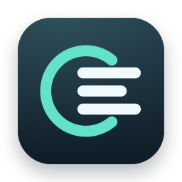

<p align="center">
  
</p>

<h1 align="center">codex-bar</h1>

<p align="center">
  <strong>任务进展、账号额度与 Token 用量，一眼掌握。</strong><br>
  为 Codex 打造的原生 macOS 菜单栏助手。
</p>

<p align="center">
  <a href="https://github.com/j-tide/codex-bar/releases/latest"></a>
  
  
  <a href="LICENSE"></a>
</p>

<p align="center">
  <strong>简体中文</strong> · <a href="README_EN.md">English</a>
</p>

<p align="center">
  <a href="https://github.com/j-tide/codex-bar/releases/latest"><strong>下载最新版</strong></a> ·
  <a href="#界面预览">界面预览</a> ·
  <a href="#功能一览">功能一览</a> ·
  <a href="#快速开始">快速开始</a> ·
  <a href="#本地开发">本地开发</a> ·
  <a href="https://github.com/j-tide/codex-bar/issues">问题反馈</a>
</p>

<p align="center">
  <picture>
    <source media="(prefers-color-scheme: dark)" srcset="docs/assets/overview-zh-dark.png">
    <source media="(prefers-color-scheme: light)" srcset="docs/assets/overview-zh-light.png">
    
  </picture>
</p>

<p align="center">
  <sub>原生界面 · 浅色与深色主题 · 中英文切换<br>展示图使用示例账号、任务、用量和评分数据。</sub>
</p>

## 少切几个窗口，多一点专注

Codex 同时跑着多个任务时，你需要知道哪些还在运行、哪些等你处理，以及当前账号还剩多少额度。codex-bar 把这些信息放进菜单栏，展开即可查看任务、切换账号、比较模型评分和回顾本机用量，无需部署额外服务。

<table>
  <tr>
    <td width="50%" valign="top">
      <h3>跟上每个任务</h3>
      <p>运行中、待处理、已完成未读，状态和数量直接可见。按 Codex 侧栏顺序浏览对话，点击即可返回对应任务。</p>
    </td>
    <td width="50%" valign="top">
      <h3>心中有数的额度</h3>
      <p>当前账号固定展示，备用账号随时切换。额度进度、重置时间、订阅状态和可用重置次数集中查看。</p>
    </td>
  </tr>
  <tr>
    <td valign="top">
      <h3>有依据地选模型</h3>
      <p>按模型与推理强度排列 Codex Radar 综合评分。前三名直观标注，悬停查看原始分数与排名依据。</p>
    </td>
    <td valign="top">
      <h3>看见使用节奏</h3>
      <p>今日、本周、本月的 Token 与会话统计，搭配 30 天用量曲线和 16 周热力图，回顾本机的 Codex 使用情况。</p>
    </td>
  </tr>
</table>

## 界面预览

中英文界面与浅色、深色主题均可在应用内切换。点击截图查看原图。

<table>
  <tr>
    <th width="50%">简体中文 · 浅色</th>
    <th width="50%">简体中文 · 深色</th>
  </tr>
  <tr>
    <td><a href="docs/assets/overview-zh-light.png"></a></td>
    <td><a href="docs/assets/overview-zh-dark.png"></a></td>
  </tr>
  <tr>
    <th>English · Light</th>
    <th>English · Dark</th>
  </tr>
  <tr>
    <td><a href="docs/assets/overview-en-light.png"></a></td>
    <td><a href="docs/assets/overview-en-dark.png"></a></td>
  </tr>
</table>

<p align="center"><sub>截图来自原生应用界面，使用示例数据；账号、任务、用量与模型评分仅用于展示。</sub></p>

## 功能一览

| 功能 | 你可以做什么 |
| :--- | :--- |
| **菜单栏状态** | 同时查看额度进度与任务计数；为零的任务状态自动隐藏，右键菜单提供打开面板、打开 Codex、刷新等快捷操作。 |
| **对话活动** | 识别运行、压缩上下文、等待输入和完成未读状态；结合本地任务元数据与 Codex 未读状态更新列表。 |
| **系统通知** | 开启后接收任务完成、需要处理及应用更新提醒；通知内容不包含对话标题或正文。 |
| **多账号管理** | 通过浏览器 OAuth 添加账号或导入账号 JSON；展示账号身份、组织与套餐，支持刷新、重新授权和移除。 |
| **额度与订阅** | 当前实现为 Plus 展示 5h / 7d 窗口，Pro 展示 7d 窗口；可切换已用 / 剩余口径，查看重置次数与到期时间。订阅日期来自订阅接口，过期缓存会明确标注。 |
| **账号切换** | 选择仅更新登录状态，或切换后重启 Codex；账号变更也会与本机登录文件同步。 |
| **模型评分矩阵** | 展示 Codex Radar 软件与视觉空间推理评测的加权综合分；每 15 分钟刷新，失败时保留本次运行中上次成功的数据。 |
| **本地用量统计** | 按事件发生的本地日期累计 Token，包含缓存输入；查看区间内去重会话数、30 天曲线与 16 周热力图。 |
| **原生外观** | 双列布局、浅色 / 深色主题、中英文即时切换；macOS 26 使用 Liquid Glass，较早版本使用系统材质回退。 |
| **自动更新** | 从 GitHub Releases 检查新版本，在面板内下载、校验并安装，展示下载进度和更新完成状态。 |

## 快速开始

### 1. 安装

需要 **macOS 15.6 或更高版本**。与本机 Codex 桌面应用配合使用；账号额度和模型评分需要网络连接。

从 [Releases](https://github.com/j-tide/codex-bar/releases/latest) 选择安装包：

| 安装包 | 安装方式 |
| :--- | :--- |
| **DMG** · 推荐 | 下载 `codexAppBar-*-setup.dmg`，打开后将应用拖入 **Applications**。 |
| **ZIP** | 下载 `codexAppBar-*-release.zip`，解压后将 `codexAppBar.app` 移入 **Applications**。 |

启动后，点击 macOS 菜单栏中的图标打开面板。后续可在应用内更新。

<details>
<summary>首次打开被 macOS 拦截？</summary>

当前发布脚本使用 ad-hoc 签名，未进行 Apple 公证。确认安装包来自本仓库 Releases 后，在「系统设置 → 隐私与安全性」中选择「仍要打开」。Release 说明提供安装包的 SHA-256，可用于核对下载文件。

</details>

<details>
<summary>为什么安装包仍叫 codexAppBar？</summary>

项目和应用显示名已更名为 **codex-bar**。为兼容现有安装与自动更新，应用包名 `codexAppBar.app`、发布附件前缀、Bundle ID 和本地数据路径沿用原有命名。旧版本也可能仍显示 CodexAppBar。

</details>

### 2. 添加账号

点击底部的 **添加**，在浏览器中完成 OAuth 登录，再返回应用。也可以通过 **导入** 读取兼容的账号 JSON。授权页面意外关闭时，可在面板中取消等待或重新发起授权。

切换到另一个账号时：

- **仅切换账号**：更新本机登录文件；正在运行的 Codex 在下次读取登录状态时使用新账号。
- **切换并重启 Codex**：更新登录文件并重启 Codex，使新账号立即生效；这会中断正在运行的任务。

### 3. 连接任务状态

在「对话活动」区域按提示 **安装 hooks**。安装器会备份已有 `~/.codex/hooks.json`，合并所需配置，并保留其他 hooks。状态脚本使用 `/usr/bin/python3`。

如需提醒，点击该区域的通知按钮并允许 macOS 通知权限。具体触发场景见 [通知说明](docs/notification-prompts.md)。

### 4. 调整偏好

底部操作栏可切换 **中文 / English**、**浅色 / 深色**、**已用 / 剩余额度**、**任务状态显示**，并在 **10 秒 / 30 秒 / 1 分钟 / 2 分钟**之间调整刷新间隔。右上角刷新按钮会同步刷新账号、额度、模型评分、本地统计并检查更新。

## 数据与隐私

codex-bar 在本机运行，不需要自建后端。它读取本地 Codex 状态，并直接访问账号接口、Codex Radar 和 GitHub Releases。

| 数据 | 来源与用途 |
| :--- | :--- |
| 账号池与当前账号 | `~/.codex/token_pool.json`、`~/.codex/auth.json`；添加、续期或切换账号时可能写入。 |
| 额度与订阅 | ChatGPT / Codex 相关接口；获取额度、账号身份、订阅日期和可用重置次数。 |
| 任务活动 | `~/.codex/codexbar/sessions/` 中的 hook 状态，结合本地 SQLite、任务索引与 `.codex-global-state.json` 解析标题、排序和未读状态。 |
| Token 统计 | 从本地 SQLite 定位会话日志，按 JSONL 中带时间戳的用量增量统计；索引缓存位于 `~/Library/Caches/codexAppBar/`，不保存提示词、回复或凭证。 |
| 模型评分与重置窗口提示 | [Codex Radar](https://codexradar.com/) 的公开数据；评分是第三方评测，重置窗口提示不替代账号实际额度。 |
| 应用更新 | 本仓库的 [GitHub Releases](https://github.com/j-tide/codex-bar/releases)。 |

**请像保护密码一样保护账号文件。** 账号池和导出的 JSON 包含登录凭证，不要提交到仓库、上传到 Issue 或附在截图中。任务通知不携带对话内容；本地用量索引只缓存统计所需的数据。

这是社区项目，与 OpenAI 无隶属关系。部分能力依赖非公开接口和 Codex 内部文件格式，上游变化可能影响兼容性。

## 常见问题

<details>
<summary>为什么没有任务状态或未读计数？</summary>

先确认 hooks 已安装，并在 Codex 中启动一个新任务。任务活动依赖本机事件与可读取的 Codex 数据；完成未读状态还需要与当前账号的 Codex 未读列表匹配。尚未产生事件、已过期或无法关联的状态不会凭空补成未读任务。

</details>

<details>
<summary>为什么用量与额度百分比对不上？</summary>

两者来自不同的数据源。额度由服务端返回；Token 用量统计此设备本地会话中的输入与输出，包含缓存输入，不代表账单金额，也不是额度百分比的换算值。跨设备使用不会自动汇总到本机统计。今天从本地零点开始，本周从周一开始，本月从 1 日开始。

</details>

<details>
<summary>为什么订阅日期或模型评分显示为缓存数据？</summary>

网络或上游接口暂时不可用时，界面可能保留上次结果并标注状态。订阅日期只采用订阅接口返回的有效期，不用登录凭证过期时间代替。模型评分可通过区域内的刷新按钮单独重试。

</details>

## 本地开发

使用带 **macOS 26 SDK 的 Xcode 26 或更新版本**；应用部署目标仍为 macOS 15.6。界面基于 SwiftUI / AppKit，统计使用系统 SQLite。

```sh
git clone https://github.com/j-tide/codex-bar.git
cd codex-bar
open codexBar.xcodeproj
```

选择 `codexBar` scheme 构建运行，或使用脚本：

```sh
# 构建并启动本地开发版
./scripts/restart-local.sh

# 只构建，不启动或替换运行中的实例
./scripts/restart-local.sh --build-only
```

运行测试：

```sh
xcodebuild test \
  -project codexBar.xcodeproj \
  -scheme codexBar \
  -destination 'platform=macOS' \
  CODE_SIGNING_ALLOWED=YES CODE_SIGN_IDENTITY=- \
  CODE_SIGN_STYLE=Manual DEVELOPMENT_TEAM=
```

<details>
<summary>代码导航与发布</summary>

| 目录 | 职责 |
| :--- | :--- |
| `codexBar/Views/` | 双列面板、账号列表、模型矩阵、统计图表与更新组件。 |
| `codexBar/Services/` | OAuth、账号存储、额度刷新、任务同步、通知和更新。 |
| `codexBar/Models/` | 账号、任务状态与元数据模型。 |
| `codexBar/Support/` | 原生菜单栏图标、弹窗行为与 Python hook。 |
| `NotificationHelper/` | macOS 通知辅助应用。 |
| `codexBarTests/` | 额度、账号并发刷新、任务状态、统计与界面回归测试。 |
| `scripts/` | 本地构建、图标生成、DMG 打包与发布工具。 |

发布前配置好 GitHub CLI 登录，并确认工作区与目标提交：

```sh
./scripts/release.sh --dry-run
./scripts/release.sh
```

脚本按 `vYYYY.MM.DD[.N]` 生成版本，构建、签名并校验 ZIP / DMG，通过 GitHub CLI 上传附件并核对 SHA-256。更多参数见 `./scripts/release.sh --help`。

</details>

## 参与贡献

欢迎通过 [Issue](https://github.com/j-tide/codex-bar/issues) 反馈问题或提出建议，也欢迎提交 Pull Request。

- 报告问题时附上 macOS、Codex 与 codex-bar 版本、复现步骤，以及已脱敏的截图或日志。
- 提交改动时聚焦一个问题；行为变更请运行相关测试，界面变更请检查中英文和浅深主题。
- 功能或安装方式变化时，请同步更新两份 README。

## 致谢与许可

基于 [xmasdong/codexbar](https://github.com/xmasdong/codexbar) 发展，感谢原作者与所有贡献者。模型评分及重置窗口数据由 [Codex Radar](https://codexradar.com/) 提供。

本项目采用 [MIT License](LICENSE)。
