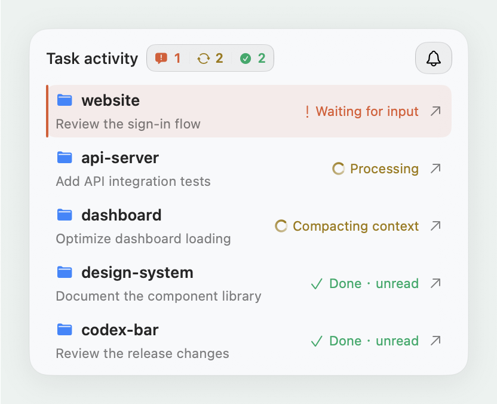
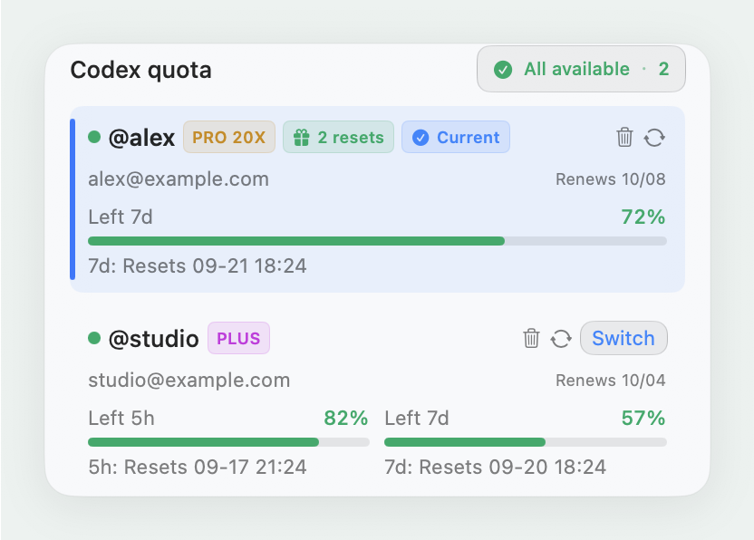
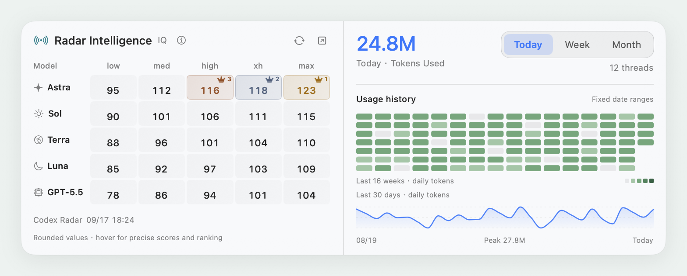

<h1 align="center">
<picture>
  <source media="(prefers-color-scheme: dark)" srcset="docs/assets/brand-en-dark.svg">
  <source media="(prefers-color-scheme: light)" srcset="docs/assets/brand-en-light.svg">
  
</picture>
</h1>

A native macOS menu bar companion for Codex.

  

  <a href="#quick-start">Quick start</a> · <a href="docs/guide.en.md">User guide</a> · <a href="https://github.com/j-tide/codex-bar/issues">Report an issue</a> · <a href="README.md">简体中文</a>

  
  
  

<picture>
  <source media="(prefers-color-scheme: dark)" srcset="docs/assets/overview-en-dark.png">
  <source media="(prefers-color-scheme: light)" srcset="docs/assets/overview-en-light.png">
  
</picture>

Native SwiftUI · Light / dark · English / Chinese Screenshots use sample accounts, tasks, usage, and scores.

## Keep up with every task

<picture>
  <source media="(prefers-color-scheme: dark)" srcset="docs/assets/tasks-en-dark.png">
  <source media="(prefers-color-scheme: light)" srcset="docs/assets/tasks-en-light.png">
  
</picture>

When several Codex tasks are running, your menu bar shows where your attention is needed.

- **See the state**: running, waiting for input, compacting, or completed and unread.
- **Return to the conversation**: tasks follow Codex sidebar order and open with a click.
- **Get timely reminders**: opt in to completion and attention notifications, without conversation content.

[Connect task activity →](docs/guide.en.md#3-connect-task-activity)

 

## Check your quota before switching

<picture>
  <source media="(prefers-color-scheme: dark)" srcset="docs/assets/accounts-en-dark.png">
  <source media="(prefers-color-scheme: light)" srcset="docs/assets/accounts-en-light.png">
  
</picture>

Keep your current and backup accounts together, with remaining quota, reset times, and subscription status in view.

- **Manage multiple accounts**: sign in with OAuth or import an account, then refresh or switch.
- **See the right windows**: 5-hour / 7-day for Plus; 7-day for Pro.
- **Choose how to switch**: update credentials alone, or switch and restart Codex.

[Explore accounts and quotas →](docs/guide.en.md#2-add-an-account)

 

## Compare models. Understand your usage.

The **model score matrix** helps you compare models and reasoning effort. **Local token statistics** show your daily, weekly, and monthly usage patterns.

<picture>
  <source media="(prefers-color-scheme: dark)" srcset="docs/assets/insights-en-dark.png">
  <source media="(prefers-color-scheme: light)" srcset="docs/assets/insights-en-light.png">
  
</picture>

Third-party Codex Radar scores · 30-day usage curve · 16-week heatmap · Distinct session counts

View every theme and language

<table>
  <tr><th>简体中文 · 浅色</th><th>简体中文 · 深色</th></tr>
  <tr>
    <td></td>
    <td></td>
  </tr>
  <tr><th>English · Light</th><th>English · Dark</th></tr>
  <tr>
    <td></td>
    <td></td>
  </tr>
</table>

## Quick start

1. **Install**: download the DMG from [Releases](https://github.com/j-tide/codex-bar/releases/latest), then drag the app into Applications. A ZIP is also available.
2. **Sign in**: open the menu bar panel and click **Add** to complete OAuth, or import an existing account.
3. **Connect tasks**: follow the hook installation prompt. Enable task reminders if you want system notifications.

Requires **macOS 15.6+** and the Codex desktop app on this Mac. Future updates can be installed directly in the app.

[First launch and installation help](docs/guide.en.md#1-install) · [All features](docs/guide.en.md#features) · [FAQ](docs/guide.en.md#faq)

## Runs locally. Keeps you in control.

Task activity and usage come from local Codex files. Quotas, scores, and updates connect to their respective services; no backend to deploy. Account files contain credentials and should be kept private. See [Data and privacy](docs/guide.en.md#data-and-privacy) for the full read/write scope.

A community project, unaffiliated with OpenAI. Some features depend on internal Codex files and unofficial APIs.

## Help shape codex-bar

[Issues](https://github.com/j-tide/codex-bar/issues) and pull requests are welcome. For UI changes, check both languages and both themes.

[Development](docs/guide.en.md#development) · [Code map and releases](docs/guide.en.md#code-map-and-releases) · [Notification behavior](docs/notification-prompts.md)

---

   
  Built on <a href="https://github.com/xmasdong/codexbar">xmasdong/codexbar</a> · Scores by <a href="https://codexradar.com/">Codex Radar</a> · <a href="LICENSE">MIT License</a>

